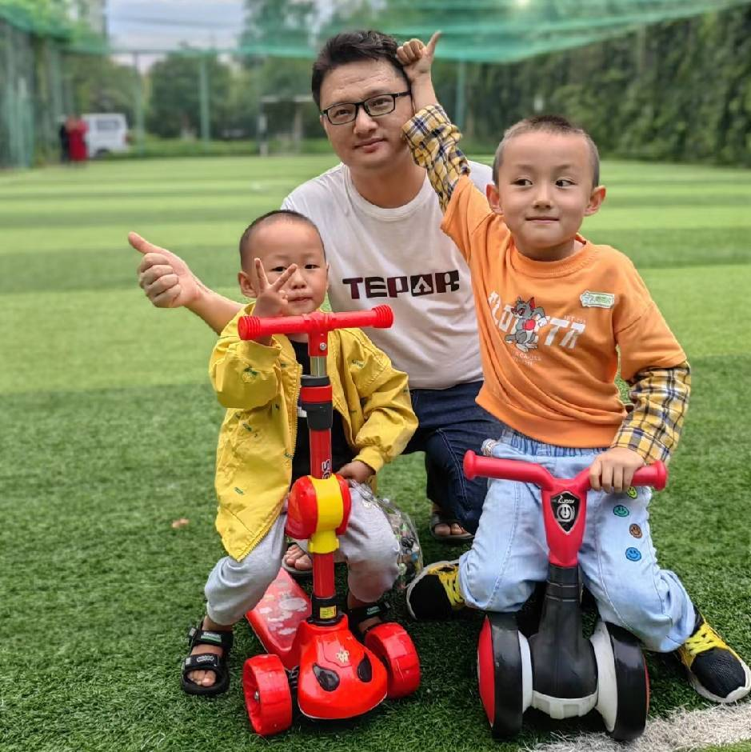

# Teanary 1.4（开发中）

### AI 原生 · 可运营的全球电商后端

> 💬 **Teanary + AI 原生 Issues 讨论组**
> 
> 欢迎加入我们的开发者社群讨论、反馈和协作！可通过右侧二维码扫描加入。
> 
> 

---

> ⚠️ **当前分支为开发版本。**
> **生产环境请使用稳定版：`v1.3.x`**

Teanary 1.4 是 Teanary 的下一代版本，目标是打造一个 **AI 原生、全球可部署、以“运营”为核心的电商后端系统**。

---

## 项目状态

| 版本     | 状态  | 说明            |
| ------ | --- | ------------- |
| v1.3.x | 稳定  | 功能已冻结，仅修复 Bug |
| v1.4.x | 开发中 | AI 原生架构与新能力   |

---

## Teanary 是什么？

Teanary 是一个基于 Laravel 构建的 **全球多节点电商后端系统**，专为以下场景设计：

* 跨境电商
* 多语言 / 多货币
* 区域化部署与支付

**1.4 版本在此基础上，引入 AI 原生的“可运营性”设计。**

> 大多数电商系统解决的是「卖货」
> **Teanary 解决的是「如何把电商运营好」**

---

## 1.4 的核心方向（规划中）

> 以下内容仍在设计与实现中。

### 🤖 AI 原生运营能力

Teanary 1.4 将 AI 视为 **系统内的协作者，而不是外挂工具**：

* 销售 / 流量 / 转化分析
* 多站点 / 多区域运营洞察
* 价格与库存风险建议
* 翻译、SEO、营销文案草稿生成
* 异常检测与运营预警

AI **不会直接访问数据库**，所有能力均通过受控接口提供。

---

### 🔌 MCP 就绪架构

Teanary 1.4 设计为可支持 **MCP（Model Context Protocol）式 AI 接入**：

* 明确的能力边界
* 权限与作用域控制
* 可审计、可回溯
* 确定性执行

> AI 只能使用系统明确允许的能力。

---

## 设计原则

* AI 辅助，而非 AI 自动化
* 关键操作必须人工确认
* 清晰的 Service 边界
* 不做“黑盒魔法”
* 以生产安全为第一原则

---

## 谁适合使用 1.4？

**适合：**

* 想参与 Teanary 下一阶段设计
* 对 AI + 电商基础设施感兴趣
* 能接受不稳定与破坏性变更

**不适合：**

* 需要稳定上线的项目
* 追求功能完整度的用户

👉 **真实业务请使用 v1.3。**

---

## 文档与快速上手

- **中文文档索引**：参见 [docs/README.md](docs/README.md)
- **English**：参见 [docs/README.en.md](docs/README.en.md)
- **部署与运维**：参见 [docs/deployment.md](docs/deployment.md)
- **多节点数据同步**：参见 [docs/sync.md](docs/sync.md)
- **愿景与设计（英文）**：参见 [docs/vision.md](docs/vision.md)

---

## 开源协议

AGPL‑3.0

---

## 🌟 贡献人员

### 💖 慷慨捐助者

感谢以下捐助者对 Teanary 项目的支持：

| 捐助者 |
| --- |
|  |
| **二十八画生** |

### 💡 建议者

感谢以下建议者为项目提供宝贵的意见和反馈：

| 测试贡献者 | 建议者 | 建议者 |
| --- | --- | --- |
|  |  |  |
| **懂普帝** | **仲秀** | **杨光** |

---

> Teanary 1.4 不是追热点
> 而是在构建一个 **能与你一起思考和决策的电商后端**
