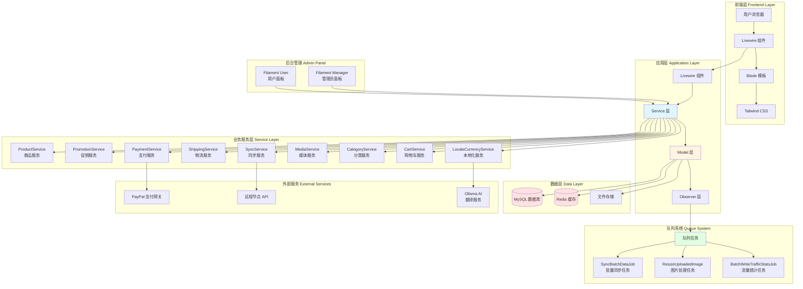
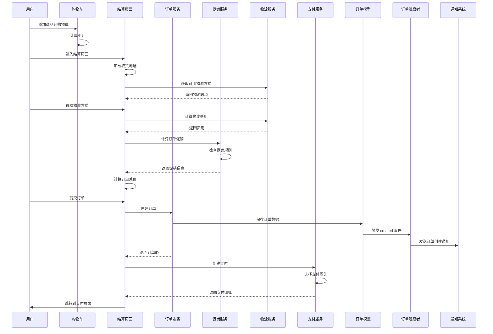
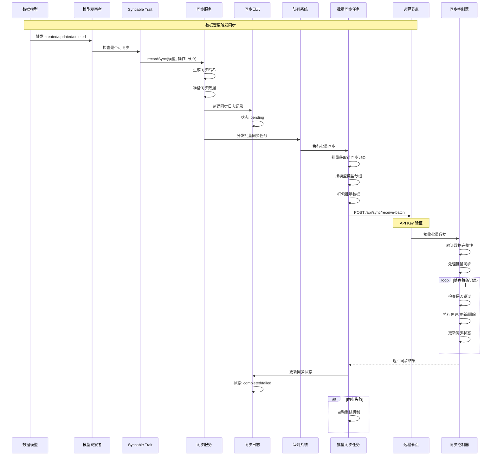
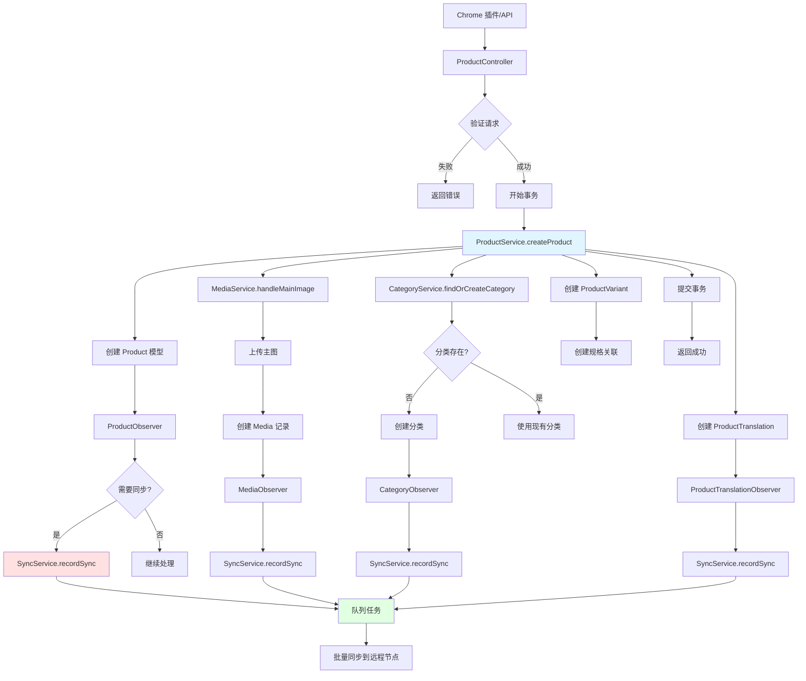
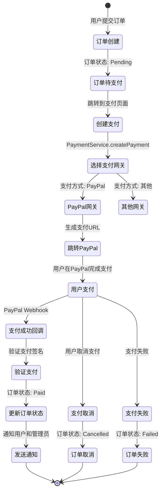
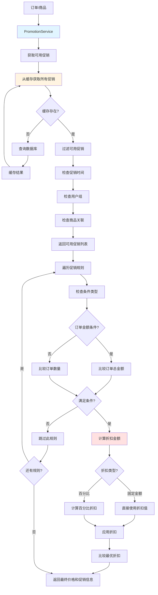

# Teanary 系统架构与数据流程图

## 目录
- [系统整体架构](#系统整体架构)
- [数据流程图](#数据流程图)
  - [订单处理流程](#订单处理流程)
  - [多节点数据同步流程](#多节点数据同步流程)
  - [商品创建流程](#商品创建流程)
  - [支付处理流程](#支付处理流程)
  - [促销计算流程](#促销计算流程)

---

## 系统整体架构



---

## 数据流程图

### 订单处理流程



### 多节点数据同步流程



### 商品创建流程



### 支付处理流程



### 促销计算流程



---

## 核心组件说明

### 1. Service 层架构

```
Services/
├── ProductService          # 商品业务逻辑
├── PromotionService        # 促销计算逻辑
├── PaymentService          # 支付处理逻辑
├── ShippingService         # 物流计算逻辑
├── SyncService            # 数据同步逻辑
├── MediaService           # 媒体文件处理
├── CategoryService        # 分类管理
├── CartService            # 购物车管理
├── LocaleCurrencyService  # 本地化服务
└── Payments/
    ├── PaymentManager     # 支付网关管理器
    └── PaypalGateway      # PayPal 支付实现
```

### 2. Model 层架构

```
Models/
├── 核心业务模型
│   ├── Product            # 商品
│   ├── ProductVariant     # 商品规格
│   ├── Order              # 订单
│   ├── Cart               # 购物车
│   └── Promotion          # 促销
├── 关联模型
│   ├── ProductCategory    # 商品分类关联
│   ├── ProductAttributeValue  # 商品属性值
│   └── OrderItem          # 订单项
├── 翻译模型
│   ├── ProductTranslation
│   ├── CategoryTranslation
│   └── PromotionTranslation
└── 系统模型
    ├── SyncLog            # 同步日志
    ├── SyncStatus         # 同步状态
    └── TrafficStatistic   # 流量统计
```

### 3. Observer 层架构

```
Observers/
├── ProductObserver           # 商品变更监听
├── OrderObserver             # 订单变更监听
├── PromotionObserver         # 促销变更监听
├── CategoryObserver          # 分类变更监听
├── MediaObserver             # 媒体变更监听
└── [其他模型观察者]
```

### 4. 数据同步机制

- **触发机制**: 通过 Observer 监听模型事件
- **同步方式**: 批量异步同步，提升效率
- **冲突解决**: 以最新数据为准（基于时间戳）
- **文件同步**: 自动同步媒体文件和转换文件
- **重试机制**: 失败自动重试，确保数据不丢失

---

## 技术栈说明

### 后端技术
- **Laravel 12.x**: Web 框架
- **PHP 8.1+**: 服务器语言
- **MySQL 8.0+**: 主数据库
- **Redis**: 缓存和会话存储
- **Laravel Octane**: 高性能应用服务器

### 前端技术
- **Livewire 3.x**: 全栈框架
- **Tailwind CSS 3.x**: CSS 框架
- **Alpine.js**: 轻量级 JS 框架
- **Vite**: 前端构建工具

### 管理后台
- **Filament 3.x**: Laravel 管理面板

---

## 数据流向总结

1. **用户请求** → Livewire 组件 → Service 层 → Model 层 → 数据库
2. **数据变更** → Observer → SyncService → 队列 → 远程节点
3. **支付流程** → PaymentService → 支付网关 → Webhook → 订单更新
4. **促销计算** → PromotionService → 缓存查询 → 规则匹配 → 折扣计算

---

**文档版本**: 1.0  
**最后更新**: 2024
